# Assignment-7_Linux

# Assignment 7 — Maven Build Management Utility

## 📌 Objective

The objective of this assignment is to create a Bash utility named `buildMaven.sh` to manage common build operations of a Maven-based Java project.

The utility supports:

* Generate project artifact
* Install artifact into local Maven repository
* Perform static code analysis

  * Checkstyle
  * FindBugs
  * PMD
* Execute unit tests
* Generate code coverage
* Deploy WAR artifact to Apache Tomcat
* Generate application documentation *(optional)*

---

## 📂 Project Used

GitHub Repository:

https://github.com/opstree/spring3hibernate.git

Clone the repository:

```bash
git clone https://github.com/opstree/spring3hibernate.git
cd spring3hibernate
```

---

# 🏗️ Overall Architecture

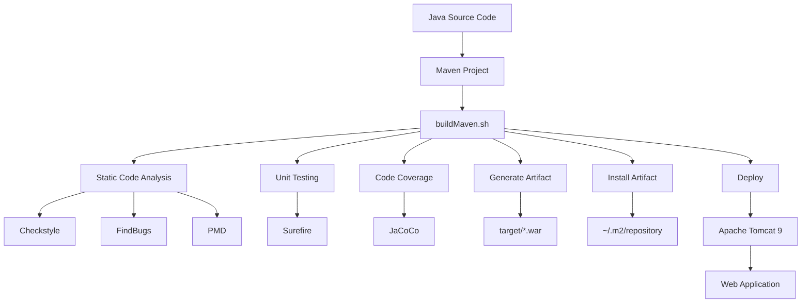

---

# 🔧 Prerequisites

Install/check the following:

### Java

```bash
java -version
```

Example:

```text
openjdk version "11.0.31"
```

### Maven

```bash
mvn -version
```

### Git

```bash
git --version
```

### Tomcat

Tomcat 9 is installed manually under:

```text
/opt/tomcat9
```

Check:

```bash
ls /opt/tomcat9
```

---

# 📁 Project Structure

```text
spring3hibernate/
│
├── pom.xml
├── buildMaven.sh
├── README.md
│
├── src/
│   ├── main/
│   │   ├── java/
│   │   └── resources/
│   │
│   └── test/
│       └── java/
│
└── target/
```

After building and testing:

```text
spring3hibernate/
│
├── pom.xml
├── buildMaven.sh
├── src/
│
└── target/
    ├── *.war
    ├── surefire-reports/
    └── site/
        └── jacoco/
            ├── index.html
            ├── jacoco.csv
            └── jacoco.xml
```

---

# 🚀 buildMaven.sh

The main utility is:

```bash
buildMaven.sh
```

Make the script executable:

```bash
chmod +x buildMaven.sh
```

Run help:

```bash
./buildMaven.sh -h
```

---

# 🏷️ Command-Line Options

| Flag   | Operation                            |
| ------ | ------------------------------------ |
| `-a`   | Generate artifact                    |
| `-i`   | Install artifact to local repository |
| `-s`   | Perform static code analysis         |
| `-t`   | Run unit tests and code coverage     |
| `-d`   | Deploy artifact to Tomcat            |
| `-doc` | Generate documentation               |
| `-h`   | Display help                         |

---

# 1️⃣ Generate Artifact

Command:

```bash
./buildMaven.sh -a
```

This generates the Maven project artifact.

Internally, Maven performs:

```bash
mvn clean package
```

The generated WAR file is placed inside:

```text
target/
```

Example:

```text
target/Spring3HibernateApp.war
```

## Figure — Artifact Generation

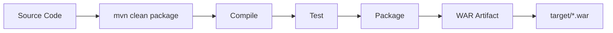

Check the artifact:

```bash
ls -lh target/
```

---

# 2️⃣ Install Artifact to Local Repository

Command:

```bash
./buildMaven.sh -i
```

Equivalent Maven command:

```bash
mvn install
```

The artifact is installed into the local Maven repository:

```text
~/.m2/repository/
```

## Figure — Maven Local Repository

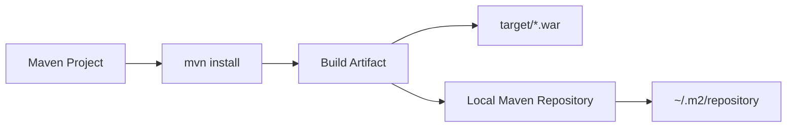

Check:

```bash
ls ~/.m2/repository/
```

---

# 3️⃣ Static Code Analysis

The utility supports:

```text
checkstyle
findbugs
pmd
```

Syntax:

```bash
./buildMaven.sh -s <tool>
```

---

## 🔹 Checkstyle

Run:

```bash
./buildMaven.sh -s checkstyle
```

Checkstyle checks source code against coding and formatting standards.

### Figure

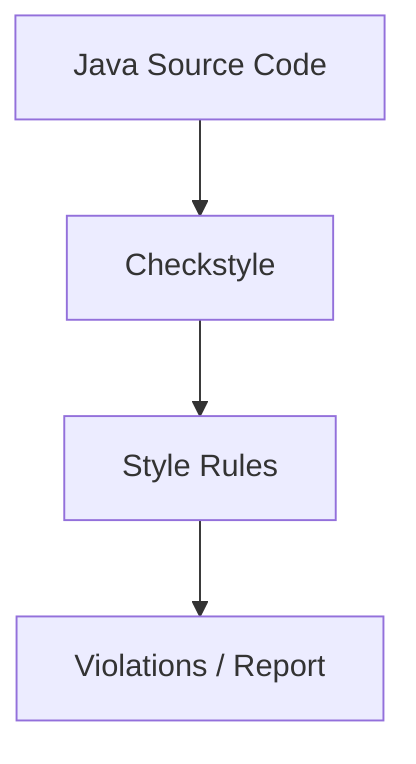

---

## 🔹 FindBugs

Run:

```bash
./buildMaven.sh -s findbugs
```

FindBugs analyzes Java code for possible bugs and problematic coding patterns.

Example findings from this project include:

```text
NM_FIELD_NAMING_CONVENTION
PT_RELATIVE_PATH_TRAVERSAL
SE_NO_SERIALVERSIONID
```

### Figure

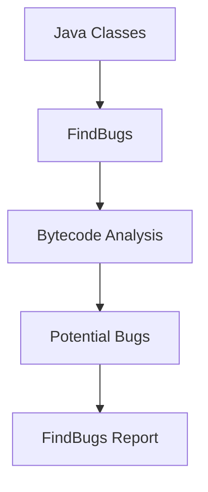

The project configuration contains:

```xml
<failOnError>false</failOnError>
```

Therefore, reported FindBugs issues do not automatically fail the Maven build.

---

## 🔹 PMD

Run:

```bash
./buildMaven.sh -s pmd
```

PMD performs static source-code analysis and identifies potential code-quality problems.

### Figure

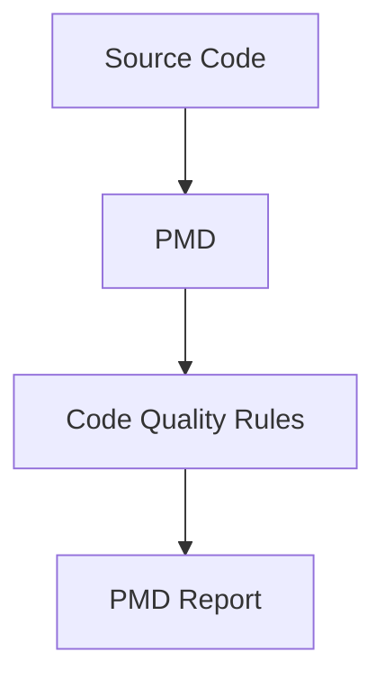

---

# 4️⃣ Unit Testing

The assignment uses Maven Surefire for unit testing.

Command:

```bash
./buildMaven.sh -t surefire
```

Equivalent Maven operation:

```bash
mvn test
```

Test reports are generated in:

```text
target/surefire-reports/
```

Check:

```bash
ls target/surefire-reports/
```

---

## 🧪 Test Result

The project successfully executed:

```text
Tests run: 3
Failures: 0
Errors: 0
Skipped: 0
```

Therefore:

```text
Unit Tests = SUCCESS
```

### Figure — Unit Testing

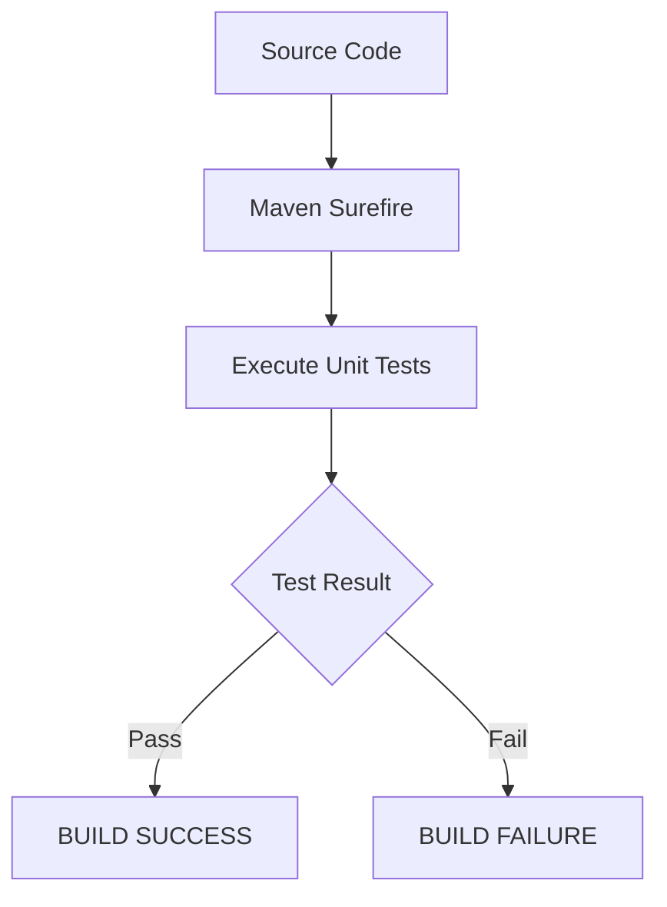

---

# 5️⃣ Code Coverage

Code coverage measures how much application code is executed by unit tests.

The project uses **JaCoCo** for code coverage.

Add the JaCoCo plugin inside the existing `<plugins>` section of `pom.xml`:

```xml
<plugin>
    <groupId>org.jacoco</groupId>
    <artifactId>jacoco-maven-plugin</artifactId>
    <version>0.8.13</version>

    <executions>
        <execution>
            <id>prepare-agent</id>
            <goals>
                <goal>prepare-agent</goal>
            </goals>
        </execution>

        <execution>
            <id>report</id>
            <phase>test</phase>
            <goals>
                <goal>report</goal>
            </goals>
        </execution>
    </executions>
</plugin>
```

Run:

```bash
mvn clean test
```

Coverage report:

```text
target/site/jacoco/index.html
```

Check:

```bash
ls target/site/jacoco/
```

Expected files:

```text
index.html
jacoco.csv
jacoco.xml
```

### Figure — Code Coverage

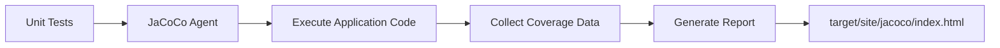

---

# 6️⃣ Deploy Artifact to Tomcat

Command:

```bash
./buildMaven.sh -d
```

The deployment process copies the generated WAR file to:

```text
/opt/tomcat9/webapps/
```

Check:

```bash
sudo ls -lh /opt/tomcat9/webapps/
```

---

## Figure — Tomcat Deployment

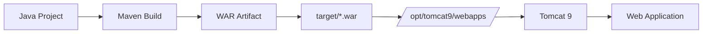

---

# 7️⃣ Tomcat 9

Tomcat is installed at:

```text
/opt/tomcat9
```

Important directories:

```text
/opt/tomcat9/
│
├── bin/
├── conf/
├── lib/
├── logs/
├── temp/
├── webapps/
└── work/
```

Start Tomcat:

```bash
sudo /opt/tomcat9/bin/startup.sh
```

Stop Tomcat:

```bash
sudo /opt/tomcat9/bin/shutdown.sh
```

Check port:

```bash
sudo ss -lntp | grep 8080
```

Test locally:

```bash
curl -I http://localhost:8080/
```

---

# 8️⃣ Tomcat Manager

Tomcat Manager URL:

```text
http://<EC2-PUBLIC-IP>:8080/manager/html
```

The Manager configuration is located at:

```text
/opt/tomcat9/webapps/manager/META-INF/context.xml
```

The Tomcat users configuration is:

```text
/opt/tomcat9/conf/tomcat-users.xml
```

Example Manager user:

```xml
<role rolename="manager-gui"/>
<user username="tomcat"
      password="your-password"
      roles="manager-gui"/>
```

---

# 9️⃣ EC2 Deployment

This project can be deployed on an AWS EC2 instance.

Architecture:

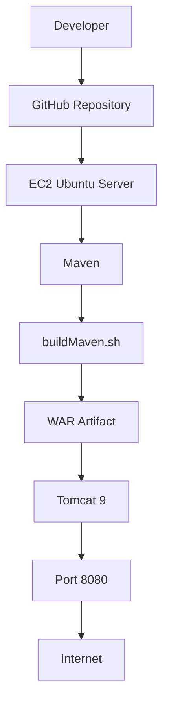

The EC2 Security Group should allow TCP port:

```text
8080
```

Then the application can be accessed using:

```text
http://EC2-PUBLIC-IP:8080/
```

---

# 🔟 Optional — Generate Documentation

Command:

```bash
./buildMaven.sh -doc
```

Equivalent Maven command:

```bash
mvn site
```

Documentation is generated under:

```text
target/site/
```

### Figure

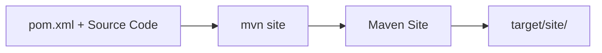

---

# 1️⃣1️⃣ Optional — Build Quality Thresholds

The assignment also provides an optional requirement to fail the build when quality thresholds are not met.

Possible thresholds:

```text
Code Coverage >= 80%
Checkstyle violations <= allowed limit
FindBugs violations <= allowed limit
PMD violations <= allowed limit
```

### Figure — Quality Gate

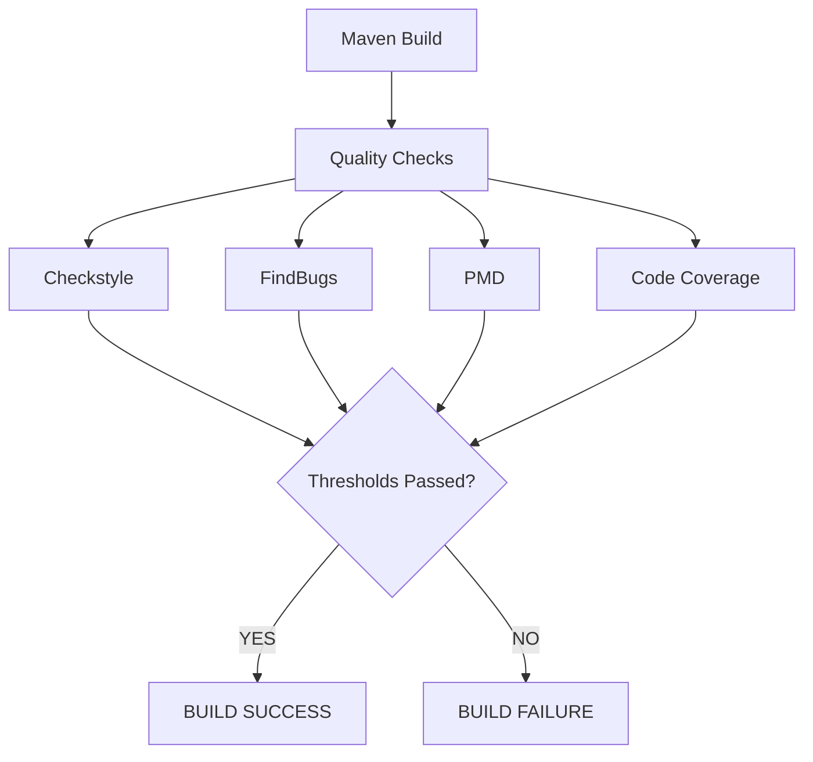

---

# 1️⃣2️⃣ Complete Command List

Run all commands from the Maven project directory:

```bash
cd ~/spring3hibernate
```

### Help

```bash
./buildMaven.sh -h
```

### Generate artifact

```bash
./buildMaven.sh -a
```

### Install artifact

```bash
./buildMaven.sh -i
```

### Checkstyle

```bash
./buildMaven.sh -s checkstyle
```

### FindBugs

```bash
./buildMaven.sh -s findbugs
```

### PMD

```bash
./buildMaven.sh -s pmd
```

### Unit tests + coverage

```bash
./buildMaven.sh -t surefire
```

### Deploy to Tomcat

```bash
./buildMaven.sh -d
```

### Documentation

```bash
./buildMaven.sh -doc
```

---

# 1️⃣3️⃣ Complete Assignment Workflow

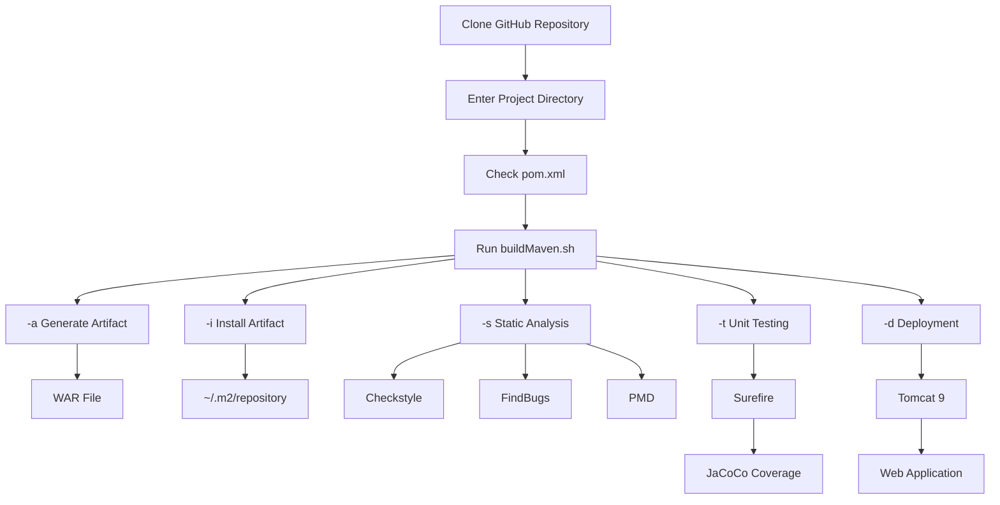

---

# 1️⃣4️⃣ Final Result

The assignment combines:

```text
Bash
  +
Maven
  +
Java
  +
Checkstyle
  +
FindBugs
  +
PMD
  +
Surefire
  +
JaCoCo
  +
Tomcat 9
```

into one automation utility:

```text
                buildMaven.sh
                      │
       ┌──────────────┼──────────────┐
       │              │              │
       ▼              ▼              ▼
     Build         Analyze         Test
       │              │              │
       ▼        ┌─────┼─────┐        ▼
      WAR       │     │     │    Surefire
       │        ▼     ▼     ▼        │
       │   Checkstyle FindBugs PMD   ▼
       │                         JaCoCo
       │
       ▼
     Deploy
       │
       ▼
   Tomcat 9
```

## 🎯 Conclusion

The `buildMaven.sh` utility provides a centralized way to perform Maven build operations from the command line.

It simplifies the process of:

1. Building the application
2. Generating the WAR artifact
3. Installing the artifact
4. Performing static code analysis
5. Running unit tests
6. Generating code coverage
7. Deploying the application to Tomcat
8. Generating documentation
9. Applying optional quality gates
